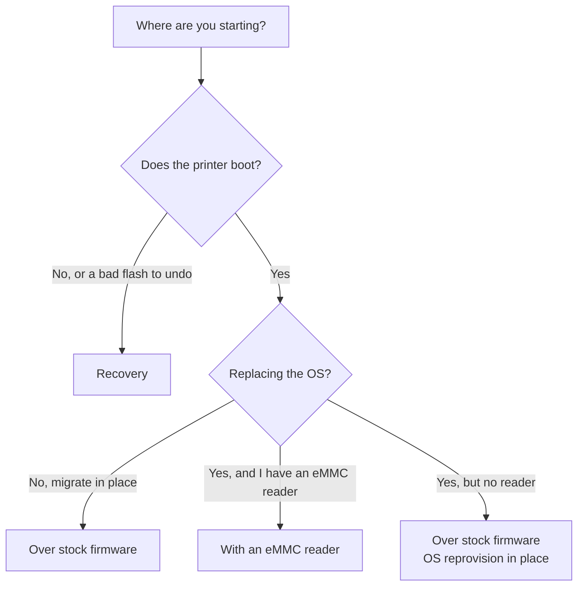

# Runbooks — pick your path

A runbook doesn't repeat the how-to. It routes you through the layer components in the right order for one concrete situation, and forwards you from each step to the next. Read [the four-layer model]() once, then pick the path that matches where you're starting.

- **[Over stock firmware]()** — the printer works and you migrate in place. The vendor OS stays; the application and MCU firmware move to upstream; the OS is optional at the end.
- **[With an eMMC reader]()** — clean-slate build from a blank or reflashed eMMC: OS first, application on top, MCUs usually untouched because they survived whatever you're rebuilding from.
- **[Recovery]()** — a machine that won't boot, or a bad flash to roll back.

No reader and you still want a fresh OS? You can reprovision the OS in place — see [in place, no eMMC reader]() — then join the application steps of either runbook.
