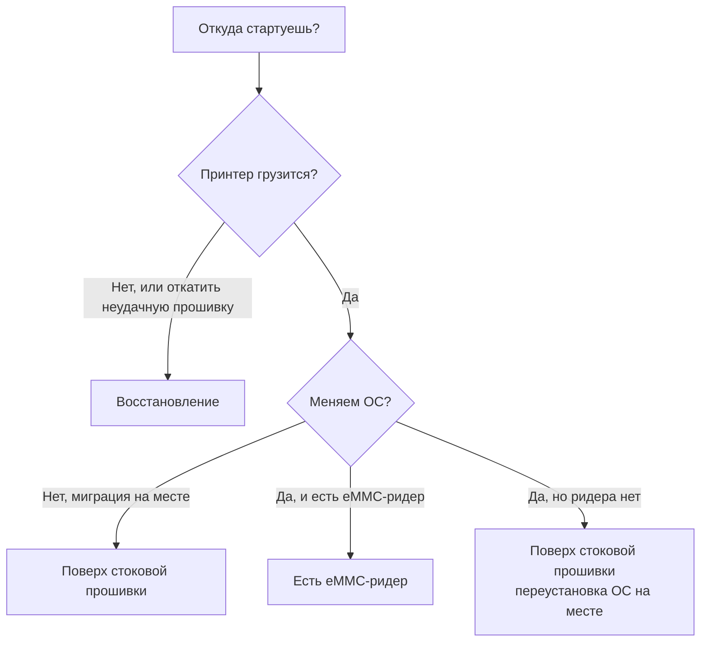

# Runbook-и — выбери свой путь

Runbook не повторяет how-to. Он проводит тебя через компоненты слоёв в правильном порядке под одну конкретную ситуацию и форвардит от каждого шага к следующему. Прочитай [четырёхслойную модель]() один раз, потом выбери путь под то, откуда ты стартуешь.

- **[Поверх стоковой прошивки]()** — принтер работает, и ты мигрируешь на месте. Вендорская ОС остаётся; приклад и прошивка MCU переезжают на upstream; ОС опциональна в конце.
- **[Есть eMMC-ридер]()** — сборка с чистого листа с пустого или перепрошитого eMMC: сначала ОС, приклад сверху, MCU обычно не трогаем, потому что они пережили то, из чего ты пересобираешь.
- **[Восстановление]()** — машина не грузится, или надо откатить неудачную прошивку.

Ридера нет, а свежую ОС всё равно хочешь? ОС можно переустановить на месте — см. [на месте, без eMMC-ридера]() — а потом присоединиться к шагам приклада любого из runbook-ов.
